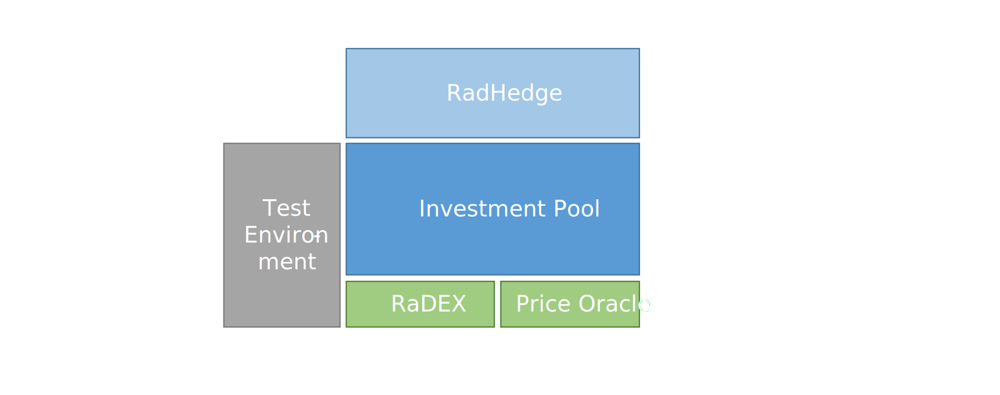

# RadHedge

The RadHedge crate is a prototype / proof-of-concept of a decentralized asset management platform meant to be operating on the Radix-Dlt. It is built with Scrypto v0.4.1 on the Radix Engine V2.
Further information on Radix-DLT can be found here:  [Radix-DLT Docs](docs.radix-dlt.com).

This blueprint was created to participate in the Scrypto challenge related to [Yield Farming / Portfolio Management](https://www.radixdlt.com/post/portfolio-management-and-yield-farming-challenge-is-live) and was initially committed [here](https://github.com/radixdlt/scrypto-challenges/tree/main/4-portfolio-management-yield-farming/RadHedge).

## Table of Contents

- [RadHedge](#radhedge)
  - [Table of Contents](#table-of-contents)
  - [Abstract](#abstract)
  - [Motivation](#motivation)
  - [Key Features related to the Pool Manager](#key-features-related-to-the-pool-manager)
    - [Creating a pool](#creating-a-pool)
    - [The Pool Manager Badge](#the-pool-manager-badge)
    - [Funding of the pool](#funding-of-the-pool)
    - [Performance fee](#performance-fee)
    - [Base currency](#base-currency)
  - [Key Features related to the Investors](#key-features-related-to-the-investors)
    - [Non-custodial](#non-custodial)
    - [Investing](#investing)
    - [Pool tracking tokens](#pool-tracking-tokens)
    - [Withdrawing](#withdrawing)
  - [Architecture](#architecture)
  - [Example of use](#example-of-use)
  - [Considerations and future improvements](#considerations-and-future-improvements)
    - [Note](#note)
    - [Improvements](#improvements)

## Abstract

The decentralized asset management platform introduces by this crate is called RadHedge. Individual asset pools are called `Investment-Pools`. Investment-Pools essentially provide two user roles a `Pool Manager` and `Investors`.

The `Pool Manager` is the actor that actually creates the Investment Pool and manages all investment funds of the pool. For now an Investment Pool can only have exactly one Pool Manager at any given time. The main target of a Pool Manager is to choose assets that perform well and thus increase the value of the pool. With good performance the Pool Manager can collect a performance fee.

An `Investor` provides funds to the pool. An Investors target is to participate in price increases of the assets within the pool by choosing the Pool Manager with the best performance. Obviously a Pool Manager can also invest in his/her own pool and thus also take the role of an Investor.

## Motivation

The motivation of this prototype is to build a showcase of how a decentralized asset management platform can be implemented on the Radix-Dlt. In the future (and after further development) this might become one building block for the DeFi ecosystem on Radix.
The target was not to simply reimplement a set of protocols such as TokenSets or DHedge but to rebuild from the ground up using the asset-oriented concepts that Scrypto and the Radix Engine provide.

As it is built upon external blueprints for the [price_oracle](https://github.com/radixdlt/scrypto-examples/tree/main/defi/price-oracle) and the RaDEX (written by [0xOmar](https://github.com/0xOmarA/RaDEX)) this is also a very good example of how easy it is within Scrypto to interact with external components and built a layered DeFi system.

## Key Features related to the Pool Manager

The key features of the Investment Pool from the point of view of a Pool Manager are described below.

### Creating a pool

To create a pool the Pool Manager needs to call the `instantiate_pool(...)` function of the investment_pool-blueprint.

The Pool Manager needs to choose the appropriate performance_fee for his work, choose the base currency (e.g. USDT), the PriceOracle and DEX that shall be used and an appropriate name and symbol.

This function returns `the pool manager badge`.

### The Pool Manager Badge

The  Pool Manager Badge is necessary to authorize all interactions that are done in the role as Pool Manager, e.g. fund the pool, change or collect the performance fee or trade the assets of the pool on the DEX.
There exists exactly one Pool Manager Badge.

### Funding of the pool

Via `fund_pool(...)` the Pool Manager can fund the pool with initial assets of his choosing. If this method is used, no automatic rebalancing of the pools assets takes place. (This is different for the `invest(...)` method).

### Performance fee

Performance fees can be freely set (maximum of 20%) by the Pool Manager during creation of the pool and changed afterwards via the `change_fee(...)` method.

Performance fees are determined based on the principle of the "high-water-mark". Thus performance fees are only payed on the difference to the previous All-Time-High (ATH) of the pool. This methodology makes sure that investors don't have to pay performance fees based on regaining previously hold levels after a downturn. This ATH is always determined based on the whole pool, not individual investors.

Performance fees can be collected by the Pool Manager at any given moment (if there are accrued fees at that moment) via the `collect_fee(...)` method. Performance fees are payed out in the form of newly minted pool tracking tokens (see below).

To make sure that new Investors only have to pay fees based on new performance and leaving Investors pay their fee based on previous performance both `investing` and `withdrawing` funds are events that lead to collecting accrued performance fees. Fees that are collected due to these events are hold in a vault internal of the Investment Pool until the Pool Manager collects them.

### Base currency

The pool manager gets to decide the base currency for the Investment Pool. All investments and withdrawals are done via the base currency. Also rebalancing of invested assets is done based on their valuations in the base currency.

## Key Features related to the Investors

### Non-custodial

The Investment Pools are non-custodial in the sense that the pool manager does not have any access to the assets in the pools. He is able to trade the assets, but he will never be able to withdraw them. All assets are kept in a decentralized component. No one has access to that. The only way to access the assets of the Investment Pool is by providing pool tracking tokens.

### Investing

If an Investor wants to invest funds into an Investment Pool he/she can do so by calling the `invest(...)` methods. The provided funds need to be in the base currency of the Investment Pool.

During investing the provided funds (in base currency) are automatically split up and traded on the DEX to get the necessary assets of the pool. This is done to make sure that new investments don't change the balance/percentage of each asset in the pool. DEX transaction fees are payed by the investor.

To keep track of the investment the Investment Pool returns pool tracking tokens to the investor.

### Pool tracking tokens

Pool tracking tokens represent ones exact share of ownership of the pool. They are returned to the investor after an investment. The only way to withdraw assets from the pool is to provide the tracking tokens. Of course you can also trade your pool tracking tokens on a secondary market (not implemented here) to reduce transactions fees.

### Withdrawing

Investors can redeem their investment by calling the `withdraw` method and providing pool tracking tokens. The redeemed assets of the pool are traded automatically back to the base currency and returned to the investor. DEX transaction fees are payed by the investor.

## Architecture

The core component of this crate is the `investment_pool.rs`. It holds all the core functionality related to managing and investing in a fund. As was written above the trading functionalities are implemented by integrating external DEXes and Price Oracles. For this version of the Investment Pool the integrated DEX is the [RaDEX](https://github.com/0xOmarA/RaDEX) (written by 0xOmar) and a simple [Price Oracle](https://github.com/radixdlt/scrypto-examples/tree/main/defi/price-oracle). The Investment Pools interact directly with these components.
As noted under [Improvements](#improvements) it was originally planned to also write a kind-of-dashboard component: the RadHedge. The RadHedge would provide a one-stop interface to compare/rank all existing Investment Pools as well as provide the main interface to interact with these pools.
Finally, to perform basic testing of the investment_pool.rs blueprint a simple Test Environment was created in `test_environment.rs`.

## Example of use

This blueprint was tested using the simulation environment.
To setup scrypto and the simulation environment follow the steps outlined on: [Install Scrypto](https://docs.radixdlt.com/main/scrypto/getting-started/install-scrypto.html).

One of the major benefits of the Radix Dlt and Scrypto is the atomic composability of transactions. One way to do this is via `Transaction Manifests (.rtm)`. For further information see [Transaction Manifest Specs](https://docs.radixdlt.com/main/scrypto/transaction-manifest/specs.html).

To perform very basic integration testing and to show case the usage of the investment_pool blueprint I created a couple of test transactions. These can be found in the "test_transaction" folder.
Furthermore, to test the investment_pool blueprint another blueprint was written that creates a simple test environment: `test_environment.rs`
This test environment sets up multiple currencies, the DEX (also funding the liquidity pools) and the Price Oracle. This `test_environment.rs` blueprint is ONLY for testing purposes and NOT part of the investment_pool blueprint.

Please also see the `show_case.sh` Bash script that runs through all of the test transactions and provides further info on what is being tested and how these transactions work.
On WindowsOS the `show_case.sh` can be run via the GitBash.

## Considerations and future improvements

### Note

This blueprint was created to participate in the Scrypto challenge related to [Yield Farming / Portfolio Management](https://www.radixdlt.com/post/portfolio-management-and-yield-farming-challenge-is-live).

Initially I research a lot related to necessary functionalities of a decentralized asset management platform and also had to get a better understanding of Scrypto and the transaction manifests. Thats why in the end this code (from first to last line!) was written in the last 7 days of the challenge (while also working at a full time job). For me it feels incredibly rewarding how much can be achieved in such a short time.

Unfortunately however I ran out of time to actually finish this project. Therefore especially the testing was not finished at all and wasn't nearly done as thorough as I would do in other circumstances.

### Improvements

There is quite a lot of functionality that I wanted to include but didn't manage to do so in time. Also during development various new ideas came up. Here are some of the future improvements:

1. Build a one-stop location on-chain: Build another blueprint on top of the Investment Pool. This blueprint shall be the main interface to pool managers and investors and hold all instantiated investment_pools. This will be called the **"RadHedge"**.
2. Build a web-frontend as graphical interface to the RadHedge.
3. Implement private investment_pools with whitelisting
4. Implement the possibility to make the investment_pool work with various DEXs and Oracles.
5. Implement a score for the best performing Investment Pools.
6. Implement multiple base currencies (let the pool manager decide which ones).
7. Implement a multi-admin scheme to make it easier to have multiple pool-managers.
8. Implement a DAO structure for general governance of the protocol and to decided on changes of the protocol.

**Low Hanging Fruits**

1. More testing! Testing via Scrypto unit testing and also more integration test via the simulator. Finally test it on the PTE!
2. Implement a feature to read out the stake of the pool_manager (his share of assets on the pool.)
3. Analyze and optimize for transaction fees and slippage.
4. Lock up newly invested funds for at least 24 hours.
5. Wait 42 days before a change of performance fees actually takes place.
6. Implement an on-chain way of how the fund-manager could communicate with his investors.
